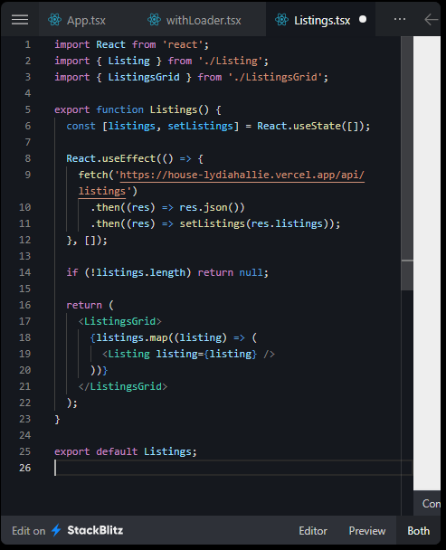

# 13 - React HOC (Higher Order Component) Pattern

### Geralmente utilizamos quando precisamos encapsular uma lógica ou regra de négocio usado em vários componentes React.

### [Nesse desafio](https://javascriptpatterns.vercel.app/patterns/react-patterns/higher-order-component#exercise) precisamos encapsular a seguinte lógica no nosso HOC: Receber uma url pra fazer a requisição e jogar o resultado em um state. Enquanto a requisição esta sendo feita, iremos exibir um componente de Loading usando a lógica `!lista.length` pra verificar se a lista foi preenchida. Também recebemos o componente que deve ser encapsulado. Então retornamos o componente de Loading enquanto a lista ainad não foi preenchida, após ser preenchida vamos exibir o componente que está utilizando o HOC.

### HOC

### Componente Listings sem uso do HOC

### Utilizando o HOC `withLoader`

#### Também achei bem dahora essa sintaxe aqui:

## Referências

- [HOC Pattern](https://www.patterns.dev/posts/hoc-pattern)
- [Higher-Order Components](https://javascriptpatterns.vercel.app/patterns/react-patterns/higher-order-component#tradeoffs)
