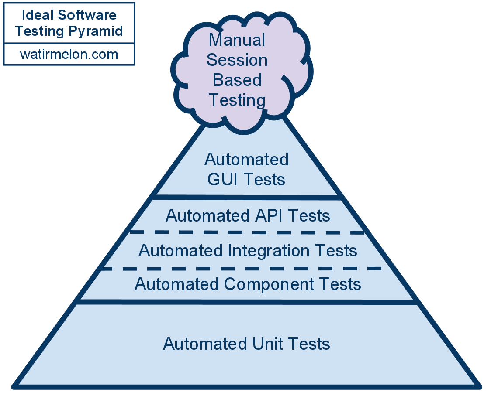

# 10 - Estratégias de testes

### Hoje estudei estratégias de testes. O dia foi bem complicado e cansativo, então peguei um assunto mais simples e teórico pra estudar.

## Resumão:

- Testes unitários: São os que como desenvolvedor, já estou habituado a escreve-los. São basicamente testes escritos de programadores, para programadores, em uma linguagem de programação específica, com o intuito de garantir a inteção que nos temos em determinados trechos de código.
- Testes de Componentes: São tesets escrevidos por GQ em conjunto com com os desenvolvedores, onde os testes de aceitação encapsulam um componente específico e testa suas regras de négocio.
- Testes de integração: Realizados em sistemas maiores com bastante componentes, eles não chegam a testar regras de négocios específicas, são escritos para testar a sincronia de vários componentes, testando se estão "conversando" de maneira apropriada.
- Testes de Sistema: Aqui fica os testes definitivos, também não testa as regras diretamente, mas testam se o planejamento do sistema está sendo executado de maneira correta, como testes de desempenho, taxas de transferências, entre outros que dependem da demanda do produto.
- Testes exploratórios manuais: Por fim, são os testes manuais que geralmente são realizados por QA ou testadores, onde é testado o sistema para encontrar quaisquer bugs possíveis. Também pode ser realizado pelo time, como uma espécia de "Dia de caça aos bugs".

#### O ideal é que sejam realizados todos os testes camada a camada, para cobrir 100% da aplicação.

##### Exemplo de pirâmade de testes, usando algumas práticas para apurar 100% da aplicação. [Imagem original](https://medium.com/@gianegf/pir%C3%A2mide-de-testes-uma-boa-estrat%C3%A9gia-para-automa%C3%A7%C3%A3o-de-testes-na-pr%C3%A1tica-1d87e64c3a44)

## Referências

- O Códificador limpo, Cap 8
