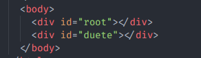
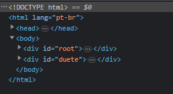
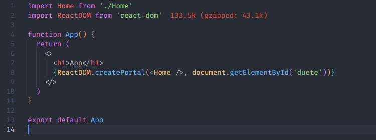
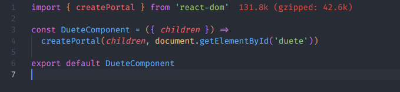
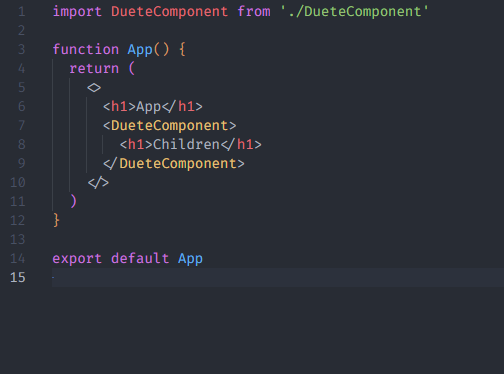
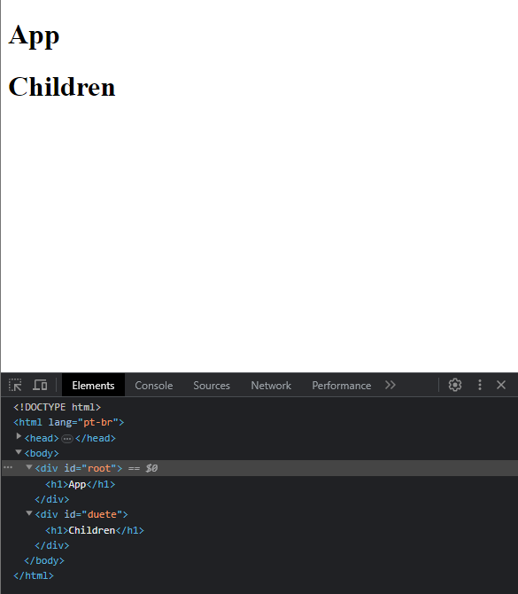
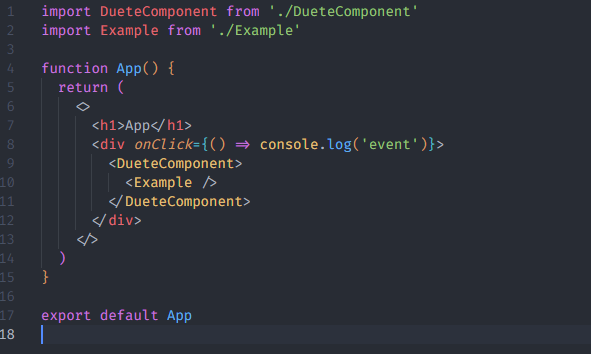
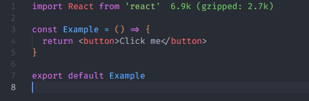
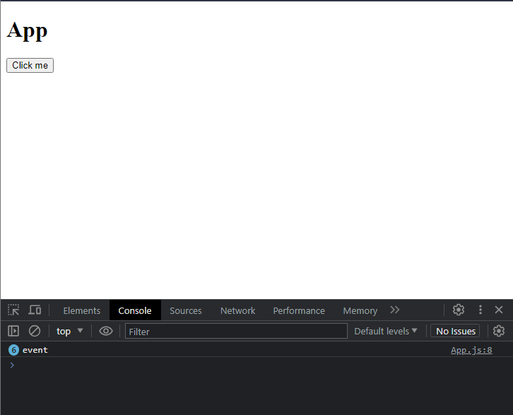

# 5 - [React Portals](https://trilha.info/roadmap/react#Portals)

No #100DiasDeCodigo de hoje estudei sobre conceitos do React Portals

Com Reaact Portals conseguimos renderizar um componente fora da árvore hierárquica do React de maneira que o relacionamento pai-filho dos componentes não sejam afetados.

### Exemplos:

##### Renderizando um componente em uma outra div:

1. Criando uma div paralela a div root

   

2. DOM

   

3. Usando ReactDOM

   

#### Passando children com Portals

1. Component

   

2. App

   

3. Resultado

   

#### Event delegation - Usando os mesmos componentes, podemos também usar eventos a partir de um portal

1. App

   

2. Example Component

   

3. Resultado
   
   Perceba que não definimos nenhum onClick no nosso button dentro do componente Example, mas a div pai tem uma propriedade onClick. Então basicamente o evento do button se propaga até que encontre o evento onClick na div pai.

### Algumas utilidades

- Alertas de Cookies
- Interagir com modais
- Telas de loading
- Use sua criatividade xD
