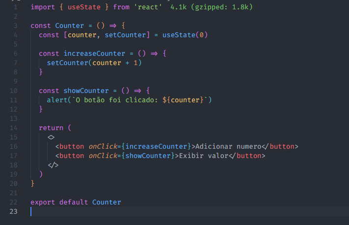
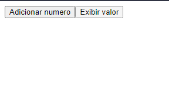
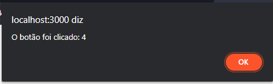
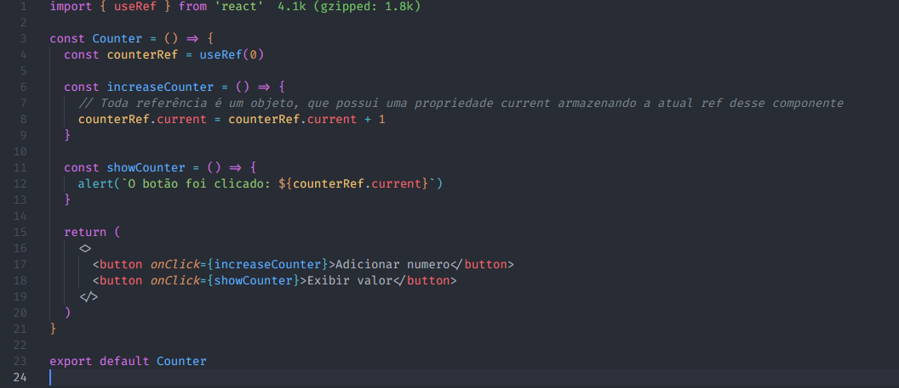
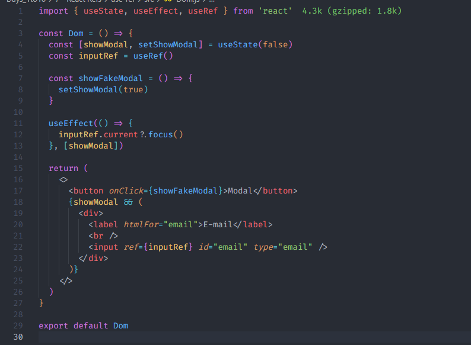
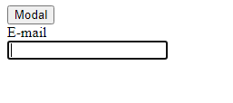
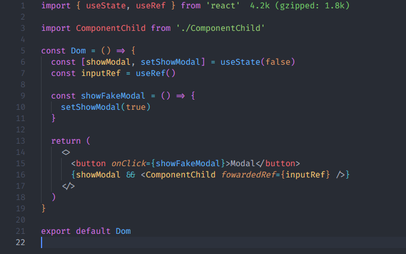
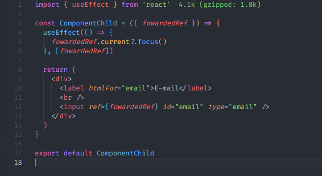

# 7 - [React Refs](https://trilha.info/roadmap/react#Refs)

### O useRef é um hook que permite referenciar um valor que não é necessário para renderização.

### Podemos utilizar o useRef como uma alterantiva para armazenar valores. A principal sacada é que quando o valor de uma Ref muda, o componente em que está inserido não é renderizado novamente. Também conseguimos acessar elementos nativos através do DOM. É ideal para ser usado quando quer prevenir renderizações desnecessárias.

# Utilização

### Vamos ver como ficaria um contador simples com um botão que exibe a quantidade de cliques feitos

### Primeiro vamos ver o resultado disso com useState

- Código

  

- Resultado

  
  

  #### A cada clique no botão 'Adicionar numero' o componente vai ser renderizado novamente de maneira desnecessária, porque só precisamos mudar o valor e exibir apenas quando clicar no botão 'Exbir valor', sendo assim, não faz sentido renderizar novamente o componente sendo que não mudará nada visualmente.

### Vamos fazer a mesma coisa com useRef

### Dessa maneira temos a mesma aplicação só que performando bem melhor, já que o componente não vai ser renderizado sempre que clicar no botão de incremento.

## Interagindo com elementos da DOM

### Nesse exemplo estamos linkando a ref `inputRef` com o elemento input do DOM. Em seguinda fazemos com que sempre que houver uma alteração no state `showModal`, automaticamente o input irá ficar em focus

### Importante saber que o atributo `ref` está presente em todo elemento do `jsx` que aceita a instância do hook useRef

## Passando refs para componentes filhos

### Dessa maneira obtemos o mesmo resultado, mas deixando cada comportamento encapsulado.

# Referências

- [React doc](https://react.dev/reference/react/useRef)
- [React legacy doc](https://pt-br.legacy.reactjs.org/docs/refs-and-the-dom.html)
- [Entenda DE VEZ o useRef - React Hooks](https://youtu.be/eypNvly4s3Q)
- [Aprenda useRef - SIMPLIFICANDO OS HOOKS DO REACT](https://www.youtube.com/watch?v=Le5SkDfi8Ic&t=1s&ab_channel=MatheusBattisti-HoradeCodar)
