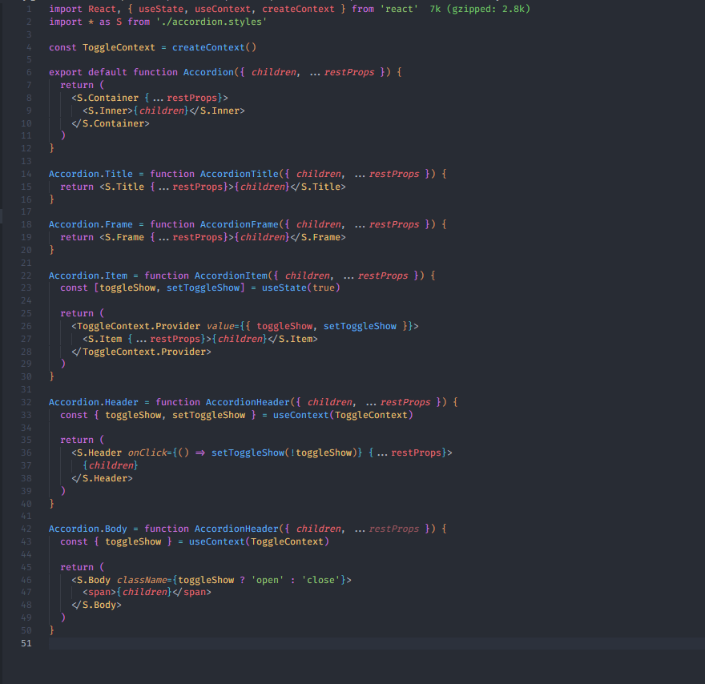
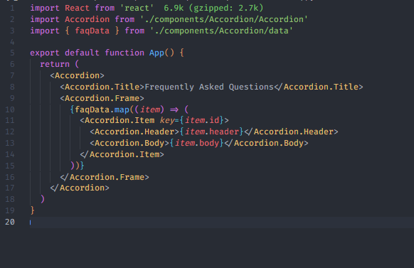

# 8 - React Compound Components

### Estou desenvolvendo um componente no trabalho, onde irei precisar aplicar o pattern Compound Components, porque preciso de bastante flexibilidade e escalabilidade. Então um colega de trabalho recomendou aplicar-mos Compound Components no componente, por isso tirei o dia hoje pra estudar o assunto.

## O que é?

### Compound Component é um padrão em React. Tem como objetivo criar um design mais flexível compartilhando o estado e lógica entre um grupo de componentes, onde a comunicação entre os componentes pai e filhos devem ser feitas de maneira flexível. Os componentes devem trabalhar juntos para realizarem algum comportamento sem criar árvores de props embaraçosas ou uma lógica complexa demais para ser refatorado ou compreendido futuramente.

#### É como se fosse a estrutura do `select` e `option` das tags em HTML:

```

<select>
  <option value="volvo">Volvo</option>
  <option value="mercedes">Mercedes</option>
  <option value="audi">Audi</option>
</select>

```

#### O `select` funciona como um gerenciador de estados da inferface, enquanto o `option` são configurados em como o `select` deve funcionar.

### O Compound Component nos ajuda a eliminar aquela inflamação de props, onde temos que passar uma árvore de props entre os componentes. Essa inflamação é um problema, porque pode causar vários re-renders desnecessários a cada estado que for atualizado, já que cada estado irá atualizar todos os componentes filho.

## [Utilização](https://www.smashingmagazine.com/2021/08/compound-components-react/#building-a-demo)

- Componente

  

- Usando

  

### Percebe-se que o componente interage por si só com seus componentes filhos, então quando vamos utiliza-lo, temos acesso também a seus componentes filhos. Perceba também como os estados ficam centralizados na context `ToggleContext`, evitando um encadeamento de props e usos de estados desnecessários.

# Estudo coletado de:

- [Compound Components In React](https://www.smashingmagazine.com/2021/08/compound-components-react/)

- [Compound Component Design Pattern in React](https://betterprogramming.pub/compound-component-design-pattern-in-react-34b50e32dea0#:~:text=Compound%20components%20are%20a%20React,children%20to%20a%20parent%20element.)

- [React: O que é, e como funciona um Compound Component?](https://www.tabnews.com.br/AdrianKnapp/react-o-que-e-e-como-funciona-um-compound-component)

- [Mastering the Compound Components Pattern in React](https://blog.bitsrc.io/mastering-the-compound-components-pattern-in-react-unleashing-flexibility-and-maintainability-d310d93508ca)
